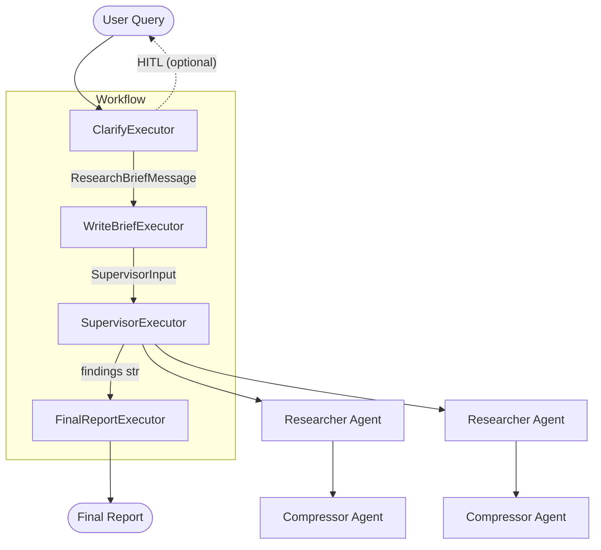

# Agent Framework Researcher

Deep research agent — a port of [langchain-ai/open_deep_research](https://github.com/langchain-ai/open_deep_research) to [microsoft/agent-framework](https://github.com/microsoft/agent-framework) (Python).

## Workflow



## Quick Start

```bash
# Install dependencies
uv sync

# Copy and fill in your API keys
cp .env.example .env

# Run (CLI)
uv run -m agent_framework_researcher

# Run (DevUI — web interface at http://localhost:8080)
uv run -m agent_framework_researcher_devui
```

## Configuration

All settings are loaded from environment variables via pydantic-settings. Just call `Configuration()`.

### LLM Provider

| Variable | Default | Description |
|----------|---------|-------------|
| `LLM_PROVIDER` | `openai` | `"openai"` or `"azure"`. Auto-detected as `"azure"` when `LLM_ENDPOINT` is set. |
| `LLM_API_KEY` | — | API key (OpenAI or Azure OpenAI) |
| `LLM_ENDPOINT` | — | Azure OpenAI endpoint URL. Omit for OpenAI. |

### Models

| Variable | Default | Description |
|----------|---------|-------------|
| `DEFAULT_MODEL` | `gpt-4.1` | Default model for all tasks |
| `RESEARCH_MODEL` | *DEFAULT_MODEL* | Model for researcher agents |
| `RESEARCH_MODEL_MAX_TOKENS` | `10000` | Max output tokens for research |
| `COMPRESSION_MODEL` | *DEFAULT_MODEL* | Model for compressing findings |
| `COMPRESSION_MODEL_MAX_TOKENS` | `10000` | Max output tokens for compression |
| `FINAL_REPORT_MODEL` | *DEFAULT_MODEL* | Model for final report |
| `FINAL_REPORT_MODEL_MAX_TOKENS` | `50000` | Max output tokens for report |

### Research Behavior

| Variable | Default | Description |
|----------|---------|-------------|
| `SEARCH_API` | `web_search` | `"web_search"` or `"none"` |
| `ALLOW_CLARIFICATION` | `true` | Ask user clarifying questions before research |
| `MAX_CONCURRENT_RESEARCH_UNITS` | `5` | Parallel researcher agents |
| `MAX_RESEARCHER_ITERATIONS` | `6` | Supervisor delegation rounds |
| `MAX_REACT_TOOL_CALLS` | `10` | Tool calls per researcher agent |
| `MAX_STRUCTURED_OUTPUT_RETRIES` | `3` | JSON parsing retries |

## Development

```bash
# Run tests
uv run pytest

# Run a single test
uv run pytest tests/test_tools.py::test_think_tool -v

# Lint
uv run ruff check .

# Type check
uv run mypy src/
```